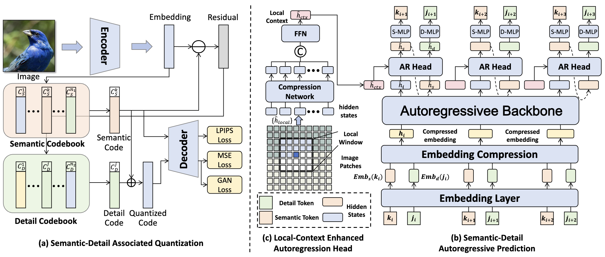

# IAR2: Improving Autoregressive Visual Generation with Semantic-Detail Associated Token Prediction


<!-- <br> -->
[Ran Yi](https://yiranran.github.io/),
[Teng Hu](https://github.com/sjtuplayer), 
[Zihan Su](./), 
and [Lizhuang Ma](https://dmcv.sjtu.edu.cn/) 
<!-- <br> -->

<div align="center">


</div>

---

## 📖 Overview

IAR2 is a novel approach for improving autoregressive visual generation through semantic-detail associated token prediction. This repository contains the official implementation of our method, including training scripts, evaluation tools, and pre-trained models.

<div align="center">



</div>

## 🚀 Quick Start

### Prerequisites

- Python 3.8+
- PyTorch 1.12+
- CUDA 11.3+

### Installation

```bash
git clone https://github.com/sjtuplayer/IAR2.git
cd IAR2
pip install -r requirements.txt
```

## 📦 Pre-trained Models

### VQ Models (VQGAN)

| Model   | Codebook Size | Embedding Dim | Image Size | Download Link                                                                        |
|---------|---------------|---------------|------------|--------------------------------------------------------------------------------------|
| `VQGAN` | 256/4096 | 8/8           | 256×256 | [VQGAN](https://huggingface.co/JTUplayer/IAR2/resolve/main/0485000.pt?download=true) |


**Note:** VQ models support two-stage training:
- Stage 1: Semantic codebook (size=256, embed_dim=8)
- Stage 2: Semantic-detail associated codebook (size=4096, embed_dim=8)


### Autoregressive Models

| Model     | Parameters | Layers | Hidden Size | Attention Heads | FID  | Download Link                                                                             |
|-----------|------------|--------|-------------|-----------------|------|-------------------------------------------------------------------------------------------|
| `IAR2-B`  | ~140M | 12 | 768 | 12 | 4.80 | [IAR2-B](https://huggingface.co/JTUplayer/IAR2/resolve/main/IAR2-B.pth?download=true)     |
| `IAR2-L`   | ~400M | 24 | 1024 | 16 | 2.76 | [IAR2-L](https://huggingface.co/JTUplayer/IAR2/resolve/main/IAR2-L.pth?download=true)     |
| `IAR2-XL`  | ~900M | 36 | 1280 | 20 | 2.10 | [IAR2-XL](https://huggingface.co/JTUplayer/IAR2/resolve/main/IAR2-XL.pt?download=true)    |
| `IAR2-XXL` | ~1.5B | 48 | 1536 | 24 | 1.76 | [IAR2-XXL](https://huggingface.co/JTUplayer/IAR2/resolve/main/IAR2-XXL.pth?download=true) |


## 🔧 Usage

---

## 🎯 Part I: Semantic-Detail Vector Quantization Training

The VQ training consists of two stages: first training a semantic codebook, then fine-tuning with semantic-detail codebook.

### 1.1 Training Semantic Codebook
Train the vector quantization model with semantic codebook:

```bash
PYTHONPATH=$PYTHONPATH:./ torchrun --nnodes=1 --nproc_per_node=8 --node_rank=0 --master_port=12345 \
    tokenizer/tokenizer_image/vq_train_first_stage.py \
    --codebook-size 256 \
    --cloud-save-path /path/to/save \
    --data-path /path/to/data \
    --image-size 256 \
    --vq-model VQ-16 \
    --global-batch-size 128 \
    --no-local-save
```

### 1.2 Training Semantic-Detail Associated Codebook
Fine-tune the VQ model with semantic-detail associated codebook:

```bash
PYTHONPATH=$PYTHONPATH:./ torchrun --nnodes=1 --nproc_per_node=8 --node_rank=0 --master_port=12345 \
    tokenizer/tokenizer_image/vq_train_second_stage.py \
    --codebook-embed-dim 8 \
    --vq-ckpt /path/to/ckpt \
    --finetune \
    --cloud-save-path /path/to/save \
    --data-path /path/to/data \
    --codebook-size 4096 \
    --image-size 256 \
    --vq-model VQ-16 \
    --global-batch-size 128 \
    --no-local-save
```

### 1.3 Reconstruction Inference
Test the reconstruction quality of trained VQ model:

```bash
torchrun --nnodes=1 --nproc_per_node=8 --node_rank=0 --master_port=12345 \
    tokenizer/tokenizer_image/reconstruction_second_stage.py \
    --data-path /path/to/data \
    --codebook-size 4096 \
    --codebook-embed-dim 8 \
    --image-size 256 \
    --image-size-eval 256 \
    --vq-ckpt /path/to/ckpt \
    --sample-dir /path/to/save \
    --per-proc-batch-size 72
```

### 1.4 VQ Evaluation
Evaluate reconstruction quality:

```bash
python evaluations/c2i/evaluator.py val_imagenet.npz samples/your_generated_samples.npz
```

To generate `val_imagenet.npz` reference file:

```bash
torchrun --nnodes=1 --nproc_per_node=8 --node_rank=0 --master_port=12345 \
    tokenizer/validation/val_ddp.py \
    --data-path /path/to/image_net
```

---

## 🚀 Part II: Autoregressive (AR) Training

The AR training involves extracting visual codes, training the autoregressive model, and generating images.

### 🎛️ Model Architecture Selection

Our framework supports multiple architectures with different scales. You can choose the appropriate model size based on your computational resources and performance requirements:

| Model     | Parameters | Layers | Hidden Size | Attention Heads | Description |
|-----------|------------|--------|-------------|-----------------|-------------|
| `IAR2-B`  | ~140M      | 12 | 768 | 12 | Base model, good balance of performance and efficiency |
| `IAR2-L`   | ~400M      | 24 | 1024 | 16 | Large model, better generation quality |
| `IAR2-XL`  | ~900B      | 36 | 1280 | 20 | Extra large model, highest quality |
| `IAR2-XXL` | ~1.5B      | 48 | 1536 | 24 | Extra extra large model, best quality |

**💡 Usage:** Simply change the `--gpt-model` parameter in training and inference commands to switch between different model architectures.

### 2.1 Extract Visual Codes
Extract discrete codes from images using trained VQ model:

```bash
PYTHONPATH=$PYTHONPATH:./ torchrun --nnodes=1 --nproc_per_node=8 --node_rank=0 --master_port=12345 \
    autoregressive/train/extract_codes_c2i.py \
    --vq-ckpt /path/to/vq-ckpt \
    --data-path /path/to/data \
    --code-path /path/to/save \
    --ten-crop \
    --crop-range 1.1 \
    --image-size 384
```

### 2.2 AR Model Training

#### DDP Training (Single Node)

```bash
PYTHONPATH=$PYTHONPATH:./ torchrun --nnodes=1 --nproc_per_node=8 --node_rank=0 --master_port=12345 \
    autoregressive/train/train_c2i_ddp.py \
    --results-dir /path/to/save \
    --code-path /path/to/code \
    --image-size 384 \
    --gpt-model GPT-B \  # Choose from: GPT-B, GPT-L, GPT-XL, GPT-XXL
    --global-batch-size 256  # Adjust based on model size and GPU memory
```

#### FSDP Training (Multi-Node, Recommended for Large Models)

```bash
PYTHONPATH=$PYTHONPATH:./ torchrun --nnodes=2 --nproc_per_node=8 --node_rank=0 \
    --master_addr="" --master_port=12345 \
    autoregressive/train/train_c2i_fsdp.py \
    --results-dir /path/to/save \
    --code-path /path/to/code \
    --image-size 384 \
    --gpt-model GPT-L \  # Choose from: GPT-B, GPT-L, GPT-XL, GPT-XXL
    --w1 2.0
```

### 2.3 Image Generation

Generate images using trained autoregressive model:

```bash
PYTHONPATH=$PYTHONPATH:./ torchrun --nnodes=1 --nproc_per_node=8 --node_rank=0 --master_port=12345 \
    autoregressive/sample/sample_c2i_ddp.py \
    --vq-ckpt /path/to/vq-ckpt \
    --gpt-ckpt /path/to/gpt-ckpt \
    --gpt-model GPT-B \  # Choose from: GPT-B, GPT-L, GPT-XL, GPT-XXL
    --image-size 384 \
    --image-size-eval 256 \
    --cfg-scale1_1 1.75 \
    --cfg-scale1_2 3.0 \
    --cfg-scale2_1 1.75 \
    --cfg-scale2_2 3.0 \
    --num-fid-samples=50000 \
    --sample-dir=/path/to/save \
    --global-seed 0 \
    --per-proc-batch-size 72 \  # Adjust based on model size and GPU memory
    --w_attn 0.05 \
    --from-fsdp
```

### 2.4 Final Evaluation
Evaluate generation quality using FID and other metrics:

```bash
python3 evaluations/c2i/evaluator.py \
    evaluations/VIRTUAL_imagenet256_labeled.npz \
    samples/your_generated_samples.npz
```

**Reference Data:** ImageNet 256x256 reference batch can be downloaded from [here](https://openaipublic.blob.core.windows.net/diffusion/jul-2021/ref_batches/imagenet/256/VIRTUAL_imagenet256_labeled.npz).

---

<div align="center">
⭐ If you find this project helpful, please consider giving it a star! ⭐
</div>